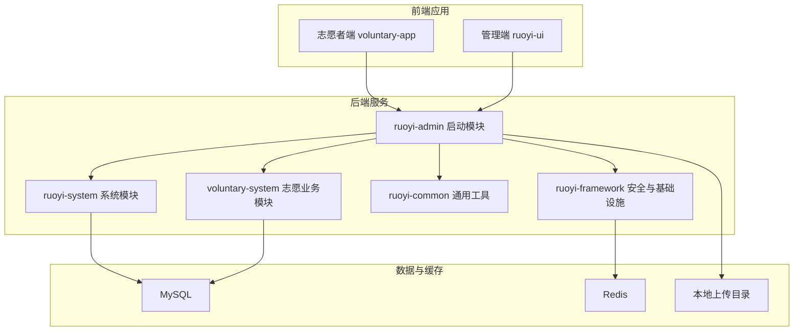
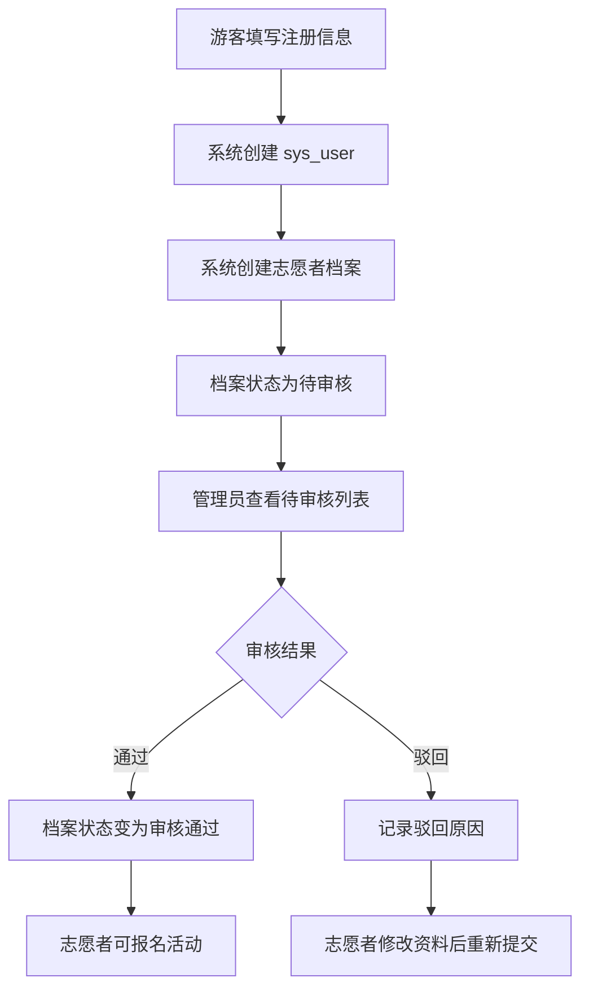
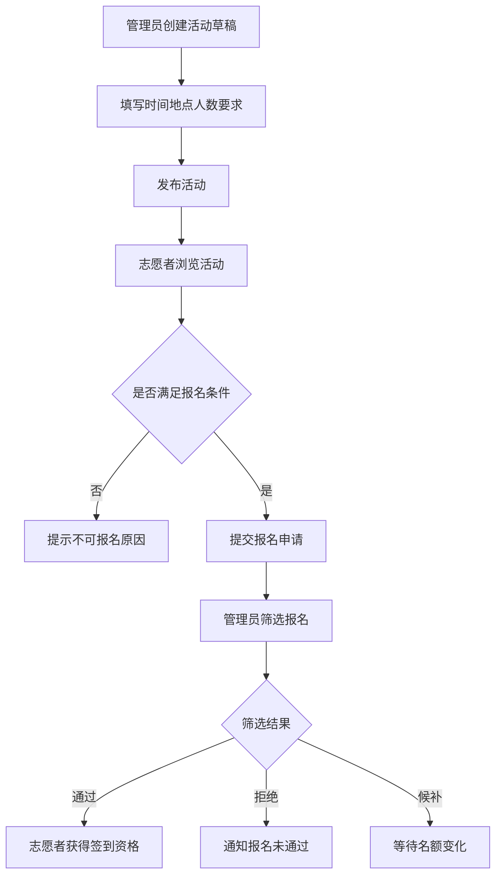
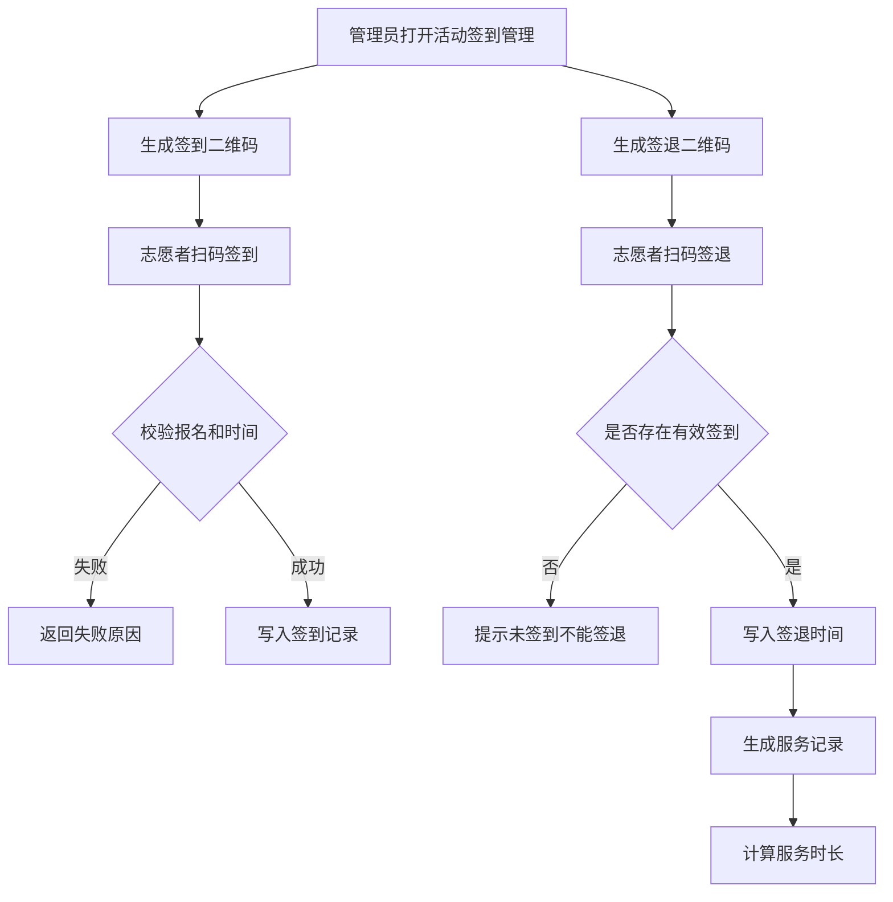
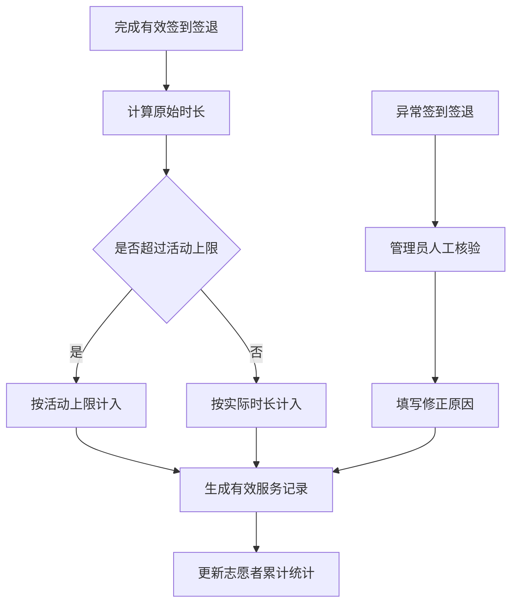

# 系统分析与总体设计

## 1. 项目定位

本系统定位为面向校园、社区和公益组织的志愿活动管理系统。系统不追求大型综合公益平台，而是围绕“志愿者注册审核、活动发布、报名筛选、二维码签到签退、服务记录生成、服务时长统计”形成清晰、可演示、可维护的业务闭环。

该定位适合毕业设计或课程项目，原因如下：

1. 业务场景具体，用户角色清晰。
2. 数据流完整，从注册到统计都有可追溯记录。
3. 有典型的软件工程内容，包括需求分析、权限设计、数据库设计、状态流转和异常处理。
4. 可在 RuoYi 基础上实现，工程复杂度可控。

## 2. 用户角色分析

| 角色 | 主要目标 | 核心操作 |
| --- | --- | --- |
| 游客 | 了解公开活动 | 浏览活动列表、查看活动详情 |
| 待审核志愿者 | 完善资料并等待审核 | 注册、登录、维护资料、查看审核结果 |
| 志愿者 | 报名并参与志愿服务 | 浏览活动、报名、签到、签退、查看服务记录 |
| 管理员 | 管理志愿活动业务 | 审核志愿者、发布活动、筛选报名、处理异常记录 |
| 超级管理员 | 管理系统基础配置 | 用户、角色、菜单、字典、日志、基础配置 |

## 3. 业务范围

### 3.1 必做范围

1. 志愿者注册、登录、退出。
2. 志愿者个人资料维护。
3. 管理员审核志愿者资料。
4. 活动创建、发布、编辑、下架。
5. 活动列表、详情、筛选查询。
6. 志愿者报名活动。
7. 管理员筛选报名人员。
8. 二维码签到。
9. 二维码签退。
10. 服务记录生成。
11. 服务时长自动统计。
12. 个人服务记录查看。
13. 管理端统计总览。

### 3.2 可选范围

1. 活动公告和站内通知。
2. 数据导出。
3. 活动分类字典。
4. 志愿者组织管理。
5. 服务证明生成。
6. 地图定位签到。
7. 动态二维码刷新。

### 3.3 暂不实现范围

1. 第三方实名认证。
2. 国家级志愿服务平台对接。
3. 在线支付、保险、捐赠。
4. 原生移动 App。
5. 复杂消息推送服务。

## 4. 总体架构设计

建议采用参考项目的 RuoYi 多模块架构。

## 5. 模块设计

### 5.1 系统基础模块

来源：RuoYi 原生模块。

职责：

1. 用户、角色、菜单、部门、岗位。
2. 登录、验证码、Token、权限控制。
3. 操作日志、登录日志、系统监控。
4. 字典、参数配置、文件上传。

### 5.2 志愿者档案模块

职责：

1. 保存志愿者真实资料。
2. 记录审核状态和审核意见。
3. 控制志愿者是否能报名和签到。
4. 支持管理员查询、审核、启用、禁用。

核心状态：

| 状态值 | 含义 |
| --- | --- |
| `0` | 待审核 |
| `1` | 审核通过 |
| `2` | 审核驳回 |
| `3` | 已禁用 |

### 5.3 活动模块

职责：

1. 管理员创建和发布活动。
2. 志愿者浏览活动列表和详情。
3. 控制报名时间、活动时间、招募人数。
4. 管理活动状态。

核心状态：

| 状态值 | 含义 |
| --- | --- |
| `0` | 草稿 |
| `1` | 已发布 |
| `2` | 已结束 |
| `3` | 已下架 |
| `4` | 已取消 |

### 5.4 报名模块

职责：

1. 志愿者提交报名。
2. 管理员筛选报名人员。
3. 维护报名状态。
4. 限制重复报名和人数超限。

核心状态：

| 状态值 | 含义 |
| --- | --- |
| `0` | 待筛选 |
| `1` | 已通过 |
| `2` | 已拒绝 |
| `3` | 候补 |
| `4` | 已取消 |

### 5.5 签到签退模块

职责：

1. 管理员生成活动签到、签退二维码。
2. 志愿者扫码签到。
3. 志愿者扫码签退。
4. 校验二维码有效性、活动状态和报名状态。
5. 拦截重复签到、重复签退、未签到先签退。

签到记录状态：

| 状态值 | 含义 |
| --- | --- |
| `0` | 已签到未签退 |
| `1` | 已签退 |
| `2` | 异常待处理 |
| `3` | 已人工确认 |

### 5.6 服务记录模块

职责：

1. 根据签到签退生成服务记录。
2. 计算服务时长。
3. 处理异常记录。
4. 支持志愿者查看个人历史。
5. 支持管理员统计和导出。

服务记录状态：

| 状态值 | 含义 |
| --- | --- |
| `0` | 待确认 |
| `1` | 有效 |
| `2` | 异常 |
| `3` | 已作废 |

### 5.7 通知与审核记录模块

职责：

1. 保存志愿者审核记录。
2. 保存活动报名处理记录。
3. 保存服务时长人工修正记录。
4. 给志愿者发送站内通知。

## 6. 核心业务流程

### 6.1 志愿者注册审核流程

关键规则：

1. 注册账号必须唯一。
2. 手机号应尽量唯一。
3. 志愿者未审核通过不能报名。
4. 关键身份信息变更后应重新审核。

### 6.2 活动发布与报名流程

关键规则：

1. 活动必须发布后才可报名。
2. 当前时间必须在报名时间范围内。
3. 同一志愿者同一活动不能重复报名。
4. 通过人数不能超过活动招募人数。

### 6.3 二维码签到签退流程

关键规则：

1. 二维码必须绑定活动和操作类型。
2. 二维码必须有有效期。
3. 签退时间必须晚于签到时间。
4. 重复签到和重复签退必须被拦截。
5. 异常记录不能自动计入有效服务时长。

### 6.4 服务时长统计流程

## 7. 页面结构设计

### 7.1 志愿者端页面

| 页面 | 路由建议 | 主要功能 |
| --- | --- | --- |
| 首页 | `/` | 活动推荐、服务数据入口 |
| 注册 | `/register` | 志愿者注册 |
| 登录 | `/login` | 志愿者登录 |
| 活动列表 | `/activities` | 活动浏览、筛选 |
| 活动详情 | `/activities/:id` | 查看详情、提交报名 |
| 我的报名 | `/signups` | 查看报名状态、取消报名 |
| 扫码结果 | `/scan` | 处理签到签退结果 |
| 服务记录 | `/service-records` | 查看历史记录和时长 |
| 个人中心 | `/me` | 资料维护、审核状态 |
| 通知中心 | `/notifications` | 查看审核和活动通知 |

### 7.2 管理端页面

| 页面 | 路由建议 | 权限标识 |
| --- | --- | --- |
| 志愿者管理 | `/voluntary/volunteer` | `manager:voluntary:volunteer:list` |
| 志愿者审核 | `/voluntary/volunteerAudit` | `manager:voluntary:volunteer:audit` |
| 活动管理 | `/voluntary/activity` | `manager:voluntary:activity:list` |
| 报名管理 | `/voluntary/signup` | `manager:voluntary:signup:list` |
| 签到签退 | `/voluntary/checkin` | `manager:voluntary:checkin:list` |
| 服务记录 | `/voluntary/serviceRecord` | `manager:voluntary:serviceRecord:list` |
| 数据统计 | `/voluntary/statistics` | `manager:voluntary:statistics:view` |
| 通知记录 | `/voluntary/notification` | `manager:voluntary:notification:list` |

## 8. 权限设计原则

1. 志愿者端接口必须校验当前登录用户，只能访问自己的报名、签到和服务记录。
2. 游客只能访问公开活动列表和活动详情。
3. 管理端接口必须使用 `@PreAuthorize` 控制权限。
4. 管理员关键操作必须写操作日志。
5. 人工补签、人工修正服务时长必须保存原因。
6. 后续如增加组织管理员，可在数据权限中限制组织范围。

## 9. 异常场景设计

| 场景 | 系统处理 |
| --- | --- |
| 未审核志愿者报名 | 拦截并提示“账号尚未审核通过” |
| 活动报名已截止 | 拦截并提示“活动报名已截止” |
| 活动名额已满 | 拦截并提示“活动名额已满” |
| 重复报名 | 返回已有报名状态 |
| 未报名扫码签到 | 拦截并提示“未报名或报名未通过” |
| 重复签到 | 返回已有签到时间 |
| 未签到直接签退 | 拦截并提示“请先签到” |
| 忘记签退 | 标记异常，等待管理员处理 |
| 服务时长过长 | 标记异常或按活动上限计入 |
| 管理员重复处理报名 | 通过状态条件更新避免覆盖 |

## 10. 总体设计结论

本系统应以 RuoYi 基础能力为底座，以 `voluntary-system` 为独立业务模块，分离志愿者端和管理端接口。业务实现应围绕注册审核、活动报名、二维码签到签退和服务时长统计展开。后续开发不应一次性实现全部功能，而应按阶段完成和验证。
