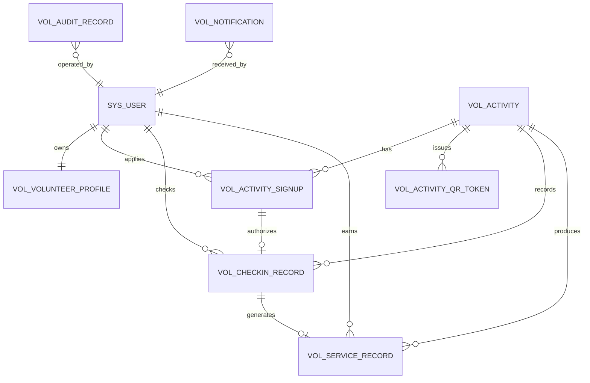
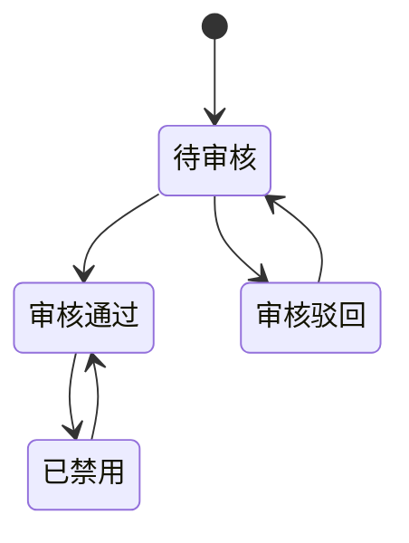
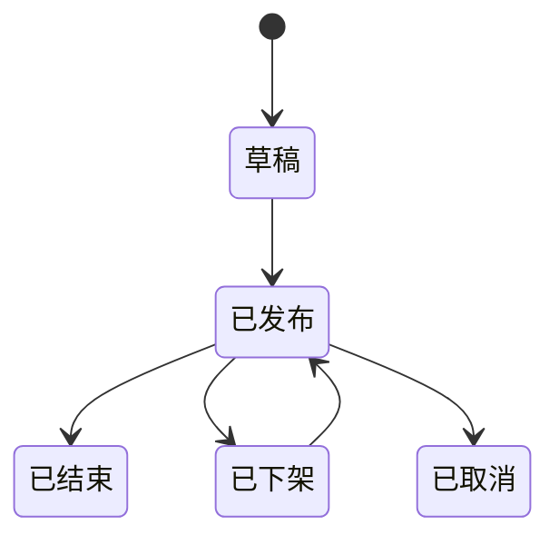
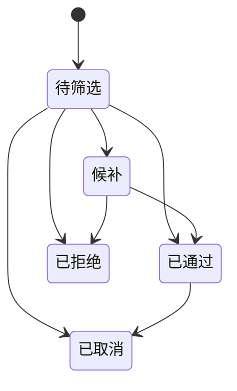

# 数据库与接口设计

## 1. 设计目标

数据库和接口设计需要支撑完整志愿活动业务闭环，并满足以下要求：

1. 志愿者、活动、报名、签到签退、服务记录之间关系清晰。
2. 每个核心业务动作都有状态字段和审计字段。
3. 服务时长可以从原始签到签退记录追溯。
4. 管理员人工修正必须留痕。
5. 菜单权限、接口路径和前端页面保持一致。

## 2. 命名约定

| 类型 | 约定 | 示例 |
| --- | --- | --- |
| 数据库名 | `ruoyi_voluntary` | `ruoyi_voluntary` |
| 业务表前缀 | `vol_` | `vol_activity` |
| 后端模块 | `voluntary-system` | `com.ruoyi.voluntary` |
| 用户端接口前缀 | `/app/voluntary` | `/app/voluntary/activities` |
| 管理端接口前缀 | `/manager/voluntary` | `/manager/voluntary/activities/list` |
| 管理端权限前缀 | `manager:voluntary` | `manager:voluntary:activity:list` |
| 环境变量前缀 | `RUOYI_VOLUNTARY` | `RUOYI_VOLUNTARY_DB_PASSWORD` |

## 3. 核心数据关系



## 4. 业务表设计

### 4.1 志愿者档案表 `vol_volunteer_profile`

用途：保存志愿者实名资料、审核状态和服务统计缓存。

| 字段 | 类型建议 | 说明 |
| --- | --- | --- |
| `id` | bigint PK | 主键 |
| `user_id` | bigint unique | 关联 `sys_user.user_id` |
| `real_name` | varchar(64) | 真实姓名 |
| `gender` | varchar(16) | 性别 |
| `id_card` | varchar(64) | 证件号，可选脱敏展示 |
| `phone` | varchar(32) | 联系电话 |
| `organization` | varchar(128) | 所属组织 |
| `major_or_class` | varchar(128) | 学院班级或社区分组 |
| `specialty` | varchar(500) | 服务特长 |
| `emergency_contact` | varchar(64) | 紧急联系人 |
| `emergency_phone` | varchar(32) | 紧急联系电话 |
| `audit_status` | tinyint | `0待审核 1通过 2驳回 3禁用` |
| `audit_reason` | varchar(500) | 审核意见 |
| `total_service_minutes` | int | 累计有效服务分钟数 |
| `service_count` | int | 有效服务次数 |
| `create_by` | varchar(64) | 创建人 |
| `create_time` | datetime | 创建时间 |
| `update_by` | varchar(64) | 更新人 |
| `update_time` | datetime | 更新时间 |
| `remark` | varchar(500) | 备注 |

建议索引：

1. `uk_volunteer_user(user_id)`
2. `idx_volunteer_audit(audit_status, create_time)`
3. `idx_volunteer_phone(phone)`

### 4.2 活动表 `vol_activity`

用途：保存志愿活动基础信息和发布状态。

| 字段 | 类型建议 | 说明 |
| --- | --- | --- |
| `id` | bigint PK | 活动 ID |
| `title` | varchar(160) | 活动标题 |
| `activity_type` | varchar(64) | 活动类型 |
| `cover_url` | varchar(255) | 封面图 |
| `service_location` | varchar(255) | 服务地点 |
| `start_time` | datetime | 活动开始时间 |
| `end_time` | datetime | 活动结束时间 |
| `signup_start_time` | datetime | 报名开始时间 |
| `signup_end_time` | datetime | 报名截止时间 |
| `recruit_count` | int | 招募人数 |
| `approved_count` | int | 已通过人数 |
| `service_target` | varchar(255) | 服务对象 |
| `content` | text | 活动内容 |
| `requirements` | varchar(1000) | 报名要求 |
| `manager_name` | varchar(64) | 负责人 |
| `manager_phone` | varchar(32) | 联系电话 |
| `max_service_minutes` | int | 最大可计入服务分钟数 |
| `status` | tinyint | `0草稿 1已发布 2已结束 3已下架 4已取消` |
| `publish_time` | datetime | 发布时间 |
| `create_by` | varchar(64) | 创建人 |
| `create_time` | datetime | 创建时间 |
| `update_by` | varchar(64) | 更新人 |
| `update_time` | datetime | 更新时间 |
| `remark` | varchar(500) | 备注 |

建议索引：

1. `idx_activity_public(status, start_time, activity_type)`
2. `idx_activity_signup_time(signup_start_time, signup_end_time)`
3. `idx_activity_title(title)`

### 4.3 活动报名表 `vol_activity_signup`

用途：保存志愿者报名申请和管理员筛选结果。

| 字段 | 类型建议 | 说明 |
| --- | --- | --- |
| `id` | bigint PK | 报名 ID |
| `activity_id` | bigint | 活动 ID |
| `volunteer_user_id` | bigint | 志愿者用户 ID |
| `real_name` | varchar(64) | 报名时姓名快照 |
| `phone` | varchar(32) | 报名时电话快照 |
| `apply_reason` | varchar(1000) | 报名理由 |
| `experience` | varchar(1000) | 相关经验 |
| `status` | tinyint | `0待筛选 1通过 2拒绝 3候补 4取消` |
| `review_reason` | varchar(500) | 筛选意见 |
| `reviewer_id` | bigint | 处理人 |
| `review_time` | datetime | 处理时间 |
| `create_by` | varchar(64) | 创建人 |
| `create_time` | datetime | 报名时间 |
| `update_by` | varchar(64) | 更新人 |
| `update_time` | datetime | 更新时间 |
| `remark` | varchar(500) | 备注 |

建议索引：

1. `uk_signup_activity_user(activity_id, volunteer_user_id)`
2. `idx_signup_activity_status(activity_id, status, create_time)`
3. `idx_signup_user_status(volunteer_user_id, status, create_time)`

### 4.4 活动二维码令牌表 `vol_activity_qr_token`

用途：保存签到签退二维码令牌。

| 字段 | 类型建议 | 说明 |
| --- | --- | --- |
| `id` | bigint PK | 主键 |
| `activity_id` | bigint | 活动 ID |
| `token` | varchar(128) unique | 二维码令牌 |
| `action_type` | varchar(16) | `checkin` 或 `checkout` |
| `expire_time` | datetime | 过期时间 |
| `status` | tinyint | `0有效 1失效` |
| `create_by` | varchar(64) | 创建人 |
| `create_time` | datetime | 创建时间 |
| `remark` | varchar(500) | 备注 |

建议索引：

1. `uk_qr_token(token)`
2. `idx_qr_activity_action(activity_id, action_type, status, expire_time)`

### 4.5 签到签退记录表 `vol_checkin_record`

用途：保存一次活动参与的签到签退原始记录。

| 字段 | 类型建议 | 说明 |
| --- | --- | --- |
| `id` | bigint PK | 主键 |
| `activity_id` | bigint | 活动 ID |
| `signup_id` | bigint | 报名 ID |
| `volunteer_user_id` | bigint | 志愿者用户 ID |
| `checkin_time` | datetime | 签到时间 |
| `checkout_time` | datetime | 签退时间 |
| `checkin_method` | varchar(32) | `qr`、`manual` |
| `checkout_method` | varchar(32) | `qr`、`manual` |
| `status` | tinyint | `0已签到 1已签退 2异常 3人工确认` |
| `abnormal_reason` | varchar(500) | 异常原因 |
| `manual_reason` | varchar(500) | 人工处理原因 |
| `operator_id` | bigint | 人工处理人 |
| `create_by` | varchar(64) | 创建人 |
| `create_time` | datetime | 创建时间 |
| `update_by` | varchar(64) | 更新人 |
| `update_time` | datetime | 更新时间 |
| `remark` | varchar(500) | 备注 |

建议索引：

1. `uk_checkin_activity_user(activity_id, volunteer_user_id)`
2. `idx_checkin_activity_status(activity_id, status, checkin_time)`
3. `idx_checkin_user(volunteer_user_id, checkin_time)`

### 4.6 服务记录表 `vol_service_record`

用途：保存最终计入统计的志愿服务记录。

| 字段 | 类型建议 | 说明 |
| --- | --- | --- |
| `id` | bigint PK | 主键 |
| `activity_id` | bigint | 活动 ID |
| `signup_id` | bigint | 报名 ID |
| `checkin_record_id` | bigint | 签到签退记录 ID |
| `volunteer_user_id` | bigint | 志愿者用户 ID |
| `service_date` | date | 服务日期 |
| `start_time` | datetime | 计入开始时间 |
| `end_time` | datetime | 计入结束时间 |
| `service_minutes` | int | 计入服务分钟数 |
| `status` | tinyint | `0待确认 1有效 2异常 3作废` |
| `confirm_user_id` | bigint | 确认人 |
| `confirm_time` | datetime | 确认时间 |
| `adjust_reason` | varchar(500) | 修正原因 |
| `create_by` | varchar(64) | 创建人 |
| `create_time` | datetime | 创建时间 |
| `update_by` | varchar(64) | 更新人 |
| `update_time` | datetime | 更新时间 |
| `remark` | varchar(500) | 备注 |

建议索引：

1. `idx_service_user_date(volunteer_user_id, service_date)`
2. `idx_service_activity(activity_id, status)`
3. `idx_service_status(status, service_date)`

### 4.7 通知表 `vol_notification`

用途：保存站内通知。

核心字段：

| 字段 | 说明 |
| --- | --- |
| `receiver_user_id` | 接收人 |
| `actor_user_id` | 触发人 |
| `notice_type` | 通知类型 |
| `target_type` | 关联对象类型 |
| `target_id` | 关联对象 ID |
| `title` | 标题 |
| `content` | 内容 |
| `action_url` | 前端跳转地址 |
| `status` | `0未读 1已读` |
| `read_time` | 阅读时间 |

### 4.8 审核记录表 `vol_audit_record`

用途：保存志愿者审核、活动发布审核、服务时长修正等记录。

核心字段：

| 字段 | 说明 |
| --- | --- |
| `auditor_id` | 审核人 |
| `target_type` | 目标类型，如 `volunteer`、`activity`、`service_record` |
| `target_id` | 目标 ID |
| `audit_status` | 审核或处理结果 |
| `audit_reason` | 原因 |
| `create_time` | 操作时间 |

## 5. 用户端接口设计

接口前缀：`/app/voluntary`

| 方法 | 路径 | 功能 | 登录要求 |
| --- | --- | --- | --- |
| `GET` | `/profile` | 查看个人志愿者档案 | 需要 |
| `PUT` | `/profile` | 修改个人资料 | 需要 |
| `GET` | `/activities` | 活动列表 | 可匿名 |
| `GET` | `/activities/{id}` | 活动详情 | 可匿名 |
| `POST` | `/activities/{id}/signups` | 报名活动 | 需要且审核通过 |
| `GET` | `/signups/mine` | 我的报名 | 需要 |
| `POST` | `/signups/{id}/cancel` | 取消报名 | 需要 |
| `POST` | `/scan/checkin` | 二维码签到 | 需要且报名通过 |
| `POST` | `/scan/checkout` | 二维码签退 | 需要且已签到 |
| `GET` | `/service-records` | 我的服务记录 | 需要 |
| `GET` | `/service-records/summary` | 我的服务时长汇总 | 需要 |
| `GET` | `/notifications` | 通知列表 | 需要 |
| `PUT` | `/notifications/{id}/read` | 标记已读 | 需要 |

## 6. 管理端接口设计

接口前缀：`/manager/voluntary`

| 方法 | 路径 | 功能 | 权限标识 |
| --- | --- | --- | --- |
| `GET` | `/volunteers/list` | 志愿者列表 | `manager:voluntary:volunteer:list` |
| `GET` | `/volunteers/{id}` | 志愿者详情 | `manager:voluntary:volunteer:query` |
| `POST` | `/volunteers/audit` | 审核志愿者 | `manager:voluntary:volunteer:audit` |
| `PUT` | `/volunteers/status` | 启用或禁用志愿者 | `manager:voluntary:volunteer:edit` |
| `GET` | `/activities/list` | 活动列表 | `manager:voluntary:activity:list` |
| `POST` | `/activities` | 新增活动 | `manager:voluntary:activity:add` |
| `PUT` | `/activities` | 编辑活动 | `manager:voluntary:activity:edit` |
| `PUT` | `/activities/status` | 发布、下架、取消活动 | `manager:voluntary:activity:edit` |
| `GET` | `/signups/list` | 报名列表 | `manager:voluntary:signup:list` |
| `PUT` | `/signups/status` | 筛选报名 | `manager:voluntary:signup:review` |
| `POST` | `/activities/{id}/qr-token` | 生成二维码令牌 | `manager:voluntary:checkin:qr` |
| `GET` | `/checkins/list` | 签到签退记录 | `manager:voluntary:checkin:list` |
| `PUT` | `/checkins/manual` | 人工补签或补签退 | `manager:voluntary:checkin:manual` |
| `GET` | `/service-records/list` | 服务记录列表 | `manager:voluntary:serviceRecord:list` |
| `PUT` | `/service-records/adjust` | 修正服务时长 | `manager:voluntary:serviceRecord:adjust` |
| `GET` | `/statistics/overview` | 数据统计总览 | `manager:voluntary:statistics:view` |

## 7. 状态流转设计

### 7.1 志愿者审核状态



### 7.2 活动状态



### 7.3 报名状态



## 8. 服务时长计算规则

基础公式：

```text
原始服务分钟数 = 签退时间 - 签到时间
有效服务分钟数 = min(原始服务分钟数, 活动最大可计入分钟数)
```

规则：

1. 签到和签退都存在时才自动生成有效服务记录。
2. 签退时间必须晚于签到时间。
3. 若活动设置了 `max_service_minutes`，超过部分不计入。
4. 若缺少签到或签退，服务记录标记为异常。
5. 管理员人工修正时必须填写 `adjust_reason`。
6. 志愿者累计时长以 `vol_service_record.status = 1` 的记录为准。

## 9. 二维码令牌设计

二维码中不直接暴露业务字段，建议只包含前端访问地址和令牌：

```text
/scan?token=xxxxxxxx
```

后端根据 token 查询：

1. 令牌是否存在。
2. 令牌是否有效。
3. 令牌是否过期。
4. 令牌绑定的活动。
5. 令牌对应操作类型：签到或签退。

令牌生成规则：

1. 使用随机 UUID 或安全随机字符串。
2. 每次生成新令牌时，可将同活动同类型旧令牌置为失效。
3. 默认有效期可设置为 10 到 30 分钟。
4. 后续可扩展为动态刷新二维码。

## 10. 菜单初始化建议

管理端业务菜单建议初始化为：

| 菜单名称 | 组件路径 | 权限 |
| --- | --- | --- |
| 志愿服务管理 | `#` | 无 |
| 志愿者管理 | `voluntary/volunteer/index` | `manager:voluntary:volunteer:list` |
| 活动管理 | `voluntary/activity/index` | `manager:voluntary:activity:list` |
| 报名管理 | `voluntary/signup/index` | `manager:voluntary:signup:list` |
| 签到签退 | `voluntary/checkin/index` | `manager:voluntary:checkin:list` |
| 服务记录 | `voluntary/serviceRecord/index` | `manager:voluntary:serviceRecord:list` |
| 数据统计 | `voluntary/statistics/index` | `manager:voluntary:statistics:view` |

按钮权限建议：

1. `manager:voluntary:volunteer:audit`
2. `manager:voluntary:activity:add`
3. `manager:voluntary:activity:edit`
4. `manager:voluntary:signup:review`
5. `manager:voluntary:checkin:qr`
6. `manager:voluntary:checkin:manual`
7. `manager:voluntary:serviceRecord:adjust`
8. `manager:voluntary:statistics:export`

## 11. 设计结论

数据库设计应围绕 `vol_volunteer_profile`、`vol_activity`、`vol_activity_signup`、`vol_checkin_record`、`vol_service_record` 五张核心表展开，通知和审核记录作为辅助支撑。接口设计应分为用户端和管理端两套路径，管理端全部纳入权限控制。
