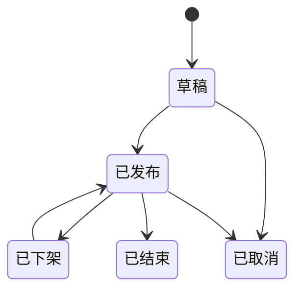
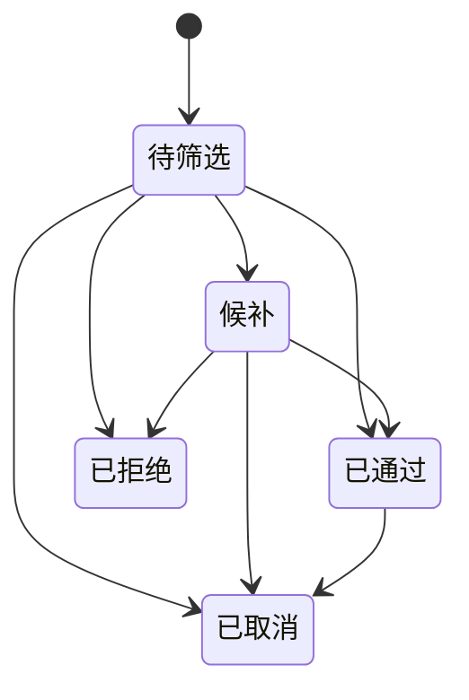

# P3 活动与报名实施方案

## 1. 阶段目标

P3 的目标是完成“活动发布、活动浏览、志愿者报名、管理员筛选”这条业务链路。P3 必须复用 P2 已完成的志愿者审核状态，保证只有审核通过的志愿者才能提交报名申请。

本阶段完成后，系统应支持：

1. 管理员创建、编辑、发布、下架和取消志愿活动。
2. 游客和志愿者浏览已发布活动列表和详情。
3. 审核通过的志愿者在报名时间内提交活动报名。
4. 志愿者查看自己的报名记录并取消报名。
5. 管理员查看报名人员并执行通过、拒绝、候补筛选。
6. 活动招募人数上限对“审核通过人数”生效。
7. P4 二维码签到签退可以基于“报名已通过”继续实现。

## 2. 阶段边界

P3 只做活动和报名，不提前实现现场签到和服务时长统计。

P3 包含：

1. `vol_activity` 活动表。
2. `vol_activity_signup` 活动报名表。
3. 活动状态字典和报名状态字典。
4. 管理端活动 CRUD、发布、下架、取消接口。
5. 用户端活动列表、详情和报名接口。
6. 用户端我的报名接口。
7. 管理端报名列表和筛选接口。
8. 管理端活动管理页面、报名管理页面。
9. 用户端活动列表、活动详情、我的报名页面接入真实接口。

P3 不包含：

1. 二维码签到和签退。
2. 签到签退记录。
3. 服务记录生成。
4. 服务时长计算。
5. 统计看板和数据导出。
6. 通知中心的正式消息投递。P3 可先在接口中返回处理结果，通知中心后置到 P5。

## 3. 现状分析

当前 P2 已完成以下基础能力：

| 能力 | 位置 | P3 复用方式 |
| --- | --- | --- |
| 志愿者注册和登录 | RuoYi 注册登录链路 | 继续使用现有账号体系 |
| 志愿者档案 | `vol_volunteer_profile` | 报名时读取姓名、手机号等快照 |
| 审核状态判断 | `IVolVolunteerProfileService.isVolunteerApproved` | 报名接口必须调用 |
| 管理端菜单目录 | `menu_id=2000` 志愿管理 | P3 在该目录下新增活动管理和报名管理 |
| 管理端页面模式 | `ruoyi-ui/src/views/voluntary/volunteer/index.vue` | 复用列表、筛选、弹窗表单和权限按钮模式 |
| 用户端页面骨架 | `voluntary-app/src/views/Activities.vue`、`ActivityDetail.vue`、`Signups.vue` | 将占位页接入真实接口 |

参考项目中宠物领养的“宠物发布、申请、审核”结构可以作为页面组织和接口分层参考，但活动字段、报名规则和状态流转必须按志愿业务重写。

## 4. 数据库设计

### 4.1 活动表 `vol_activity`

用途：保存志愿活动基础信息、报名配置、发布状态和统计缓存。

| 字段 | 类型 | 说明 |
| --- | --- | --- |
| `id` | bigint PK auto_increment | 活动 ID |
| `title` | varchar(160) | 活动标题 |
| `activity_type` | varchar(64) | 活动类型，字典 `vol_activity_type` |
| `cover_url` | varchar(255) | 封面图，P3 可先允许为空 |
| `service_location` | varchar(255) | 服务地点 |
| `start_time` | datetime | 活动开始时间 |
| `end_time` | datetime | 活动结束时间 |
| `signup_start_time` | datetime | 报名开始时间 |
| `signup_end_time` | datetime | 报名截止时间 |
| `recruit_count` | int | 招募人数 |
| `approved_count` | int | 已通过报名人数 |
| `service_target` | varchar(255) | 服务对象 |
| `content` | text | 活动内容 |
| `requirements` | varchar(1000) | 报名要求 |
| `manager_name` | varchar(64) | 活动负责人 |
| `manager_phone` | varchar(32) | 负责人联系电话 |
| `max_service_minutes` | int | 最大可计入服务分钟数，P4 计算时长时使用 |
| `status` | tinyint | `0草稿 1已发布 2已结束 3已下架 4已取消` |
| `publish_time` | datetime | 发布时间 |
| `create_by` | varchar(64) | 创建人 |
| `create_time` | datetime | 创建时间 |
| `update_by` | varchar(64) | 更新人 |
| `update_time` | datetime | 更新时间 |
| `remark` | varchar(500) | 备注 |

索引：

1. `idx_activity_public(status, start_time, activity_type)`
2. `idx_activity_signup_time(signup_start_time, signup_end_time)`
3. `idx_activity_title(title)`

### 4.2 报名表 `vol_activity_signup`

用途：保存志愿者报名申请和管理员筛选结果。

| 字段 | 类型 | 说明 |
| --- | --- | --- |
| `id` | bigint PK auto_increment | 报名 ID |
| `activity_id` | bigint | 活动 ID |
| `volunteer_user_id` | bigint | 志愿者用户 ID |
| `real_name` | varchar(64) | 报名时姓名快照 |
| `phone` | varchar(32) | 报名时联系电话快照 |
| `organization` | varchar(128) | 报名时组织快照 |
| `apply_reason` | varchar(1000) | 报名理由 |
| `experience` | varchar(1000) | 相关经验 |
| `status` | tinyint | `0待筛选 1通过 2拒绝 3候补 4取消` |
| `review_reason` | varchar(500) | 筛选意见 |
| `reviewer_id` | bigint | 处理人 |
| `reviewer_name` | varchar(64) | 处理人姓名快照 |
| `review_time` | datetime | 处理时间 |
| `create_by` | varchar(64) | 创建人 |
| `create_time` | datetime | 报名时间 |
| `update_by` | varchar(64) | 更新人 |
| `update_time` | datetime | 更新时间 |
| `remark` | varchar(500) | 备注 |

索引：

1. `uk_signup_activity_user(activity_id, volunteer_user_id)`
2. `idx_signup_activity_status(activity_id, status, create_time)`
3. `idx_signup_user_status(volunteer_user_id, status, create_time)`

唯一索引用于防止同一用户重复报名同一活动。若用户取消后再次报名，服务层更新原报名记录回到待筛选，而不是插入重复行。

### 4.3 字典设计

当前 SQL 已有 `vol_activity_type`。P3 需要补齐以下字典：

| 字典类型 | 字典值 | 说明 |
| --- | --- | --- |
| `vol_activity_status` | `0草稿 1已发布 2已结束 3已下架 4已取消` | 活动状态 |
| `vol_signup_status` | `0待筛选 1通过 2拒绝 3候补 4取消` | 报名状态 |

`vol_activity_type` 当前包含社区服务、校园服务、公益宣传。P3 暂不新增复杂分类管理，继续复用字典配置。

## 5. 状态流转规则

### 5.1 活动状态



规则：

1. 新建活动默认 `0草稿`。
2. 草稿和下架状态允许编辑核心信息。
3. 发布时必须校验标题、地点、活动时间、报名时间、招募人数等必填项。
4. 已发布活动允许下架或取消。
5. 已取消活动不可再次发布。
6. `2已结束` 可先由管理员手动置为结束；后续如有定时任务再自动处理。

### 5.2 报名状态



规则：

1. 志愿者提交报名后默认 `0待筛选`。
2. 管理员可将待筛选或候补报名处理为通过、拒绝或候补。
3. 审核通过人数不能超过活动 `recruit_count`。
4. 志愿者取消已通过报名时，需要同步减少活动 `approved_count`。
5. 被拒绝的报名不允许用户直接改为待筛选；如需再次报名，可在 P3 先要求联系管理员，避免状态复杂化。

## 6. 后端接口设计

### 6.1 用户端接口

接口前缀：`/app/voluntary`

| 方法 | 路径 | 功能 | 登录要求 |
| --- | --- | --- | --- |
| `GET` | `/activities` | 活动列表 | 可匿名 |
| `GET` | `/activities/{id}` | 活动详情 | 可匿名 |
| `POST` | `/activities/{id}/signups` | 报名活动 | 需要登录且志愿者审核通过 |
| `GET` | `/signups/mine` | 我的报名 | 需要登录 |
| `POST` | `/signups/{id}/cancel` | 取消我的报名 | 需要登录 |

活动列表查询参数：

| 参数 | 说明 |
| --- | --- |
| `pageNum`、`pageSize` | 分页 |
| `keyword` | 标题、地点模糊搜索 |
| `activityType` | 活动类型 |
| `signupOpen` | 是否只看报名中的活动 |
| `sort` | `new`、`startTime`、`signupEnd` |

报名请求体：

```json
{
  "applyReason": "报名理由",
  "experience": "相关经验"
}
```

### 6.2 管理端接口

接口前缀：`/manager/voluntary`

| 方法 | 路径 | 功能 | 权限标识 |
| --- | --- | --- | --- |
| `GET` | `/activities/list` | 活动分页列表 | `manager:voluntary:activity:list` |
| `GET` | `/activities/{id}` | 活动详情 | `manager:voluntary:activity:query` |
| `POST` | `/activities` | 新增活动 | `manager:voluntary:activity:add` |
| `PUT` | `/activities/{id}` | 编辑活动 | `manager:voluntary:activity:edit` |
| `PUT` | `/activities/{id}/status` | 发布、结束、下架、取消 | `manager:voluntary:activity:edit` |
| `GET` | `/signups/list` | 报名分页列表 | `manager:voluntary:signup:list` |
| `GET` | `/signups/{id}` | 报名详情 | `manager:voluntary:signup:query` |
| `PUT` | `/signups/{id}/review` | 筛选报名 | `manager:voluntary:signup:review` |

活动状态变更请求体：

```json
{
  "status": 1,
  "reason": "发布活动"
}
```

报名筛选请求体：

```json
{
  "status": 1,
  "reviewReason": "符合活动要求"
}
```

## 7. 后端实现计划

### 7.1 包结构

继续使用 `voluntary-system` 保存业务实体、Mapper 和 Service：

```text
com.ruoyi.voluntary.domain
com.ruoyi.voluntary.mapper
com.ruoyi.voluntary.service
com.ruoyi.voluntary.service.impl
```

Controller 放在 `ruoyi-admin`：

```text
com.ruoyi.web.controller.app.voluntary
com.ruoyi.web.controller.manager.voluntary
```

### 7.2 核心类

| 类 | 说明 |
| --- | --- |
| `VolActivity` | 活动实体 |
| `VolActivitySignup` | 报名实体 |
| `VolActivityMapper` | 活动 Mapper |
| `VolActivitySignupMapper` | 报名 Mapper |
| `IVolActivityService` | 活动服务 |
| `IVolActivitySignupService` | 报名服务 |
| `VolActivityServiceImpl` | 活动服务实现 |
| `VolActivitySignupServiceImpl` | 报名服务实现 |
| `VolAppActivityController` | 用户端活动浏览和报名接口 |
| `VolAppSignupController` | 用户端我的报名接口 |
| `VolManagerActivityController` | 管理端活动接口 |
| `VolManagerSignupController` | 管理端报名筛选接口 |

### 7.3 关键业务规则

活动发布校验：

1. 标题、类型、地点、活动时间、报名时间、招募人数必填。
2. 活动开始时间必须早于结束时间。
3. 报名开始时间必须早于报名截止时间。
4. 报名截止时间不应晚于活动开始时间。
5. 招募人数必须大于 0。
6. 最大可计入服务分钟数为空时，P4 可按实际时长；填写时必须大于 0。

志愿者报名校验：

1. 必须登录。
2. 必须存在志愿者档案。
3. `isVolunteerApproved(userId)` 必须为 `true`。
4. 活动必须为已发布。
5. 当前时间必须在报名时间范围内。
6. 同一志愿者同一活动不能重复提交有效报名。
7. 若报名记录已取消，可重新提交并恢复为待筛选。
8. 报名时保存真实姓名、手机号和组织快照，避免后续资料变化影响报名记录。

管理员筛选校验：

1. 只允许处理待筛选或候补状态的报名。
2. 处理为通过时必须检查活动已通过人数小于招募人数。
3. 处理为拒绝时建议填写原因。
4. 状态变化需要更新 `vol_activity.approved_count`。
5. 所有管理端新增、编辑、发布、筛选操作必须加 `@Log` 操作日志。

## 8. 前端实现计划

### 8.1 用户端

改造文件：

| 页面 | 目标 |
| --- | --- |
| `voluntary-app/src/api/voluntary/activity.js` | 新增活动和报名 API |
| `voluntary-app/src/views/Activities.vue` | 从占位页改为活动列表和筛选 |
| `voluntary-app/src/views/ActivityDetail.vue` | 展示活动详情和报名按钮 |
| `voluntary-app/src/views/Signups.vue` | 展示我的报名记录和取消操作 |

用户端页面规则：

1. 游客可以浏览活动列表和详情。
2. 未登录用户点击报名时跳转登录。
3. 未审核通过用户点击报名时提示进入个人中心查看审核状态。
4. 已审核通过用户可提交报名理由和相关经验。
5. 我的报名展示报名状态、活动时间、地点和处理意见。

### 8.2 管理端

新增 API：

```text
ruoyi-ui/src/api/voluntary/activity.js
ruoyi-ui/src/api/voluntary/signup.js
```

新增页面：

```text
ruoyi-ui/src/views/voluntary/activity/index.vue
ruoyi-ui/src/views/voluntary/signup/index.vue
```

页面能力：

| 页面 | 能力 |
| --- | --- |
| 活动管理 | 查询、分页、新增、编辑、发布、结束、下架、取消 |
| 报名管理 | 按活动、志愿者、状态筛选，查看详情，通过、拒绝、候补 |

菜单规划：

| 菜单ID建议 | 名称 | 类型 | 路径或权限 |
| --- | --- | --- | --- |
| `2010` | 活动管理 | 菜单 | `voluntary/activity/index` |
| `2011` | 活动查询 | 按钮 | `manager:voluntary:activity:query` |
| `2012` | 活动新增 | 按钮 | `manager:voluntary:activity:add` |
| `2013` | 活动编辑 | 按钮 | `manager:voluntary:activity:edit` |
| `2020` | 报名管理 | 菜单 | `voluntary/signup/index` |
| `2021` | 报名查询 | 按钮 | `manager:voluntary:signup:query` |
| `2022` | 报名筛选 | 按钮 | `manager:voluntary:signup:review` |

## 9. 分步推进

| 子阶段 | 内容 | 产物 | 验证 |
| --- | --- | --- | --- |
| P3-00 | 实施方案 | `docs/13-P3-活动与报名实施方案.md` | 文档与 P0-P2 设计一致 |
| P3-A | 数据库骨架 | `vol_activity`、`vol_activity_signup`、字典、菜单 SQL | 已完成，两个初始化脚本均可导入 |
| P3-B | 后端实体与 Mapper | domain、mapper、XML、基础 Service | 已完成，Maven 编译通过 |
| P3-C | 管理端活动接口 | 活动列表、详情、新增、编辑、状态变更 | 已完成，接口冒烟通过 |
| P3-D | 用户端活动接口 | 活动列表、详情、报名、我的报名 | 审核状态校验通过 |
| P3-E | 管理端报名接口 | 报名列表、详情、筛选 | 人数上限和状态流转通过 |
| P3-F | 管理端页面 | 活动管理、报名管理页面和菜单 | 管理端构建和页面验证 |
| P3-G | 用户端页面 | 活动列表、详情、我的报名页面 | 用户端构建和浏览器验证 |
| P3-H | 阶段验收 | P3 验收记录 | 活动发布到报名筛选闭环通过 |

## 10. 验收标准

P3 完成需要满足以下场景：

1. 管理员可以创建活动草稿。
2. 管理员填写完整信息后可以发布活动。
3. 游客可以浏览已发布活动列表和活动详情。
4. 未登录用户报名时会被引导登录。
5. 未审核通过志愿者不能报名。
6. 审核通过志愿者可以在报名时间内提交报名。
7. 同一志愿者不能重复报名同一活动。
8. 志愿者可以查看自己的报名记录。
9. 志愿者可以取消自己的报名。
10. 管理员可以查看活动报名人员。
11. 管理员可以将报名处理为通过、拒绝或候补。
12. 通过人数不能超过活动招募人数。
13. 报名通过后，P4 可以基于报名状态判断签到资格。

## 11. 当前下一步

P3-A 数据库骨架已完成，详细记录见 `docs/14-P3-数据库骨架记录.md`。
P3-B 后端基础类已完成，详细记录见 `docs/15-P3-后端基础类记录.md`。
P3-C 管理端活动接口已完成，详细记录见 `docs/16-P3-管理端活动接口记录.md`。

下一步进入 P3-D 用户端活动接口：

1. 新增用户端活动浏览接口。
2. 实现已发布活动列表和活动详情。
3. 实现活动报名接口，复用 P2 志愿者审核状态校验。
4. 实现我的报名和取消报名接口。
5. 运行 Maven 编译和用户端活动接口冒烟验证。

## 12. P3-A 验证记录

P3-A 已完成以下验证：

1. `sql/ruoyi_voluntary.sql` 可完整导入。
2. `sql/ruoyi_voluntary_minimal.sql` 可完整导入。
3. 当前初始化表数量为 24。
4. `vol_activity_status` 和 `vol_signup_status` 字典完整。
5. `voluntary_admin` 角色已绑定 12 个志愿管理相关菜单权限。

## 13. P3-B 验证记录

P3-B 已完成以下验证：

1. 新增活动和报名实体、Mapper、XML、基础 Service。
2. `mvn -pl voluntary-system -am compile -DskipTests` 执行通过。
3. `mvn -pl ruoyi-admin -am compile -DskipTests` 执行通过。
4. `voluntary-system` 模块编译通过，当前编译源文件数量为 16。

## 14. P3-C 验证记录

P3-C 已完成以下验证：

1. 新增 `VolManagerActivityController`。
2. 补齐活动新增、编辑、状态变更服务方法。
3. `mvn -pl ruoyi-admin -am compile -DskipTests` 执行通过。
4. `mvn -pl ruoyi-admin -am package -DskipTests` 执行通过。
5. 临时后端运行级验证通过：登录、活动新增、列表、详情、编辑、发布、下架、重新发布、结束、草稿取消接口均返回 `code=200`。
